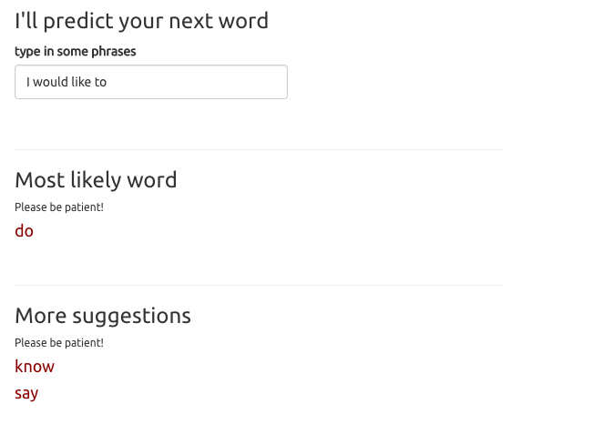

Word Prediction App
========================================================
author: Luoyan Yong
date: 15-06-2021
autosize: true

App description
========================================================
The goal of the app is to make typing easier and faster for users by **predicting** the
next words the user is going to input following what the user has already typed. 

**Limitations**
Since the model builds on a great deal of data (~4.4million), the computation time it takes to form a prediction is long. So instead of using the entire dataset, a random sample of it is used. This can reduce computation time at the cost of some accuracy.

**Try it out**
[ here!](https://luoyan-yong.shinyapps.io/word_prediction_app_lyong/)

App basic function
========================================================
The app takes single word or phrases as input

App secondary function
========================================================
User can also click on the "dataset" tab to view information about the dataset used to build the model:

- top 10 bigrams
- top 10 trigrams
- word cloud of top 100 words

How does the prediction work?
========================================================
1. A 30,000 sample of sentences taken from various sources(news, blogs, twitter).

2. The whole data set is stripped of punctuations and common stop words, and then broken down into pairs/triplets of words (bigrams/trigrams)

3. The model is built off the back-off model:
  - last two words are compared first to the trigram 
  - prediciton is picked as the third word of the trigram occuring at the highest frequency
  - if there are no matches, the last word of the input is compared to the bigram
  - prediction is then the second word of the bigram occuring at the highest frequency
